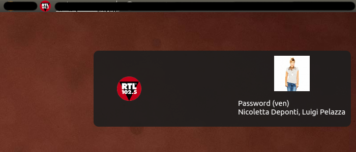
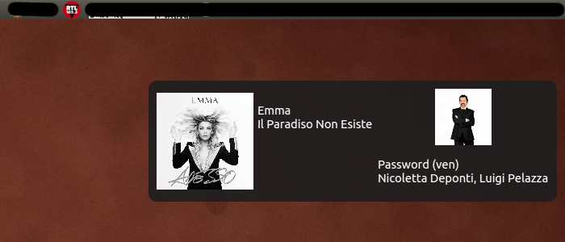

# rtl102.5-playlist
RTL 102.5 (private Italian radio station) on-the-air playlist parser for VLC.
Radio's website: www.rtl.it, and Wikipedia entry: https://en.wikipedia.org/wiki/RTL_102.5

## How to use (v. 2)
Create application launcher:

- Open gedit and paste as below.

    ```
    #!/usr/bin/env xdg-open
    [Desktop Entry]
    Version=2.0
    Type=Application
    Terminal=false
    Exec=python <your-path>/rtl102.5-playlist/Main.py
    Name=RTL 102.5 Playlist
    Comment=RTL 102.5 plugin
    Icon=<your-path>/rtl102.5-playlist/icon.png
    ```
- Change `<your-path>` to your path to files.
- Save file as: `RTL 102.5 Playlist.desktop`
- Make your file executable: open properties or run `chmod +x RTL\ 102.5\ Playlist.desktop`
- Add application launcher to `/usr/share/applications/`: `sudo cp <your-path>/rtl102.5-playlist/RTL\ 102.5\ Playlist.desktop /usr/share/applications/`
- Double click on your file and listen.





Application have 5 seconds lag on turning on and 5-10 seconds lag on turning off.

## How to use (v. 1)
* Run stream `http://shoutcast.rtl.it:3010/stream/1/` using VLC.
* Open terminal and run `python rtl1025-playlist.py`.
* Example output:
```
$ python rtl1025-playlist.py 
song_cover     : http://is4.mzstatic.com/image/thumb/Music6/v4/6f/77/c4/6f77c47b-6aea-51cf-d855-839ba257b462/source/600x600bb.jpg
speakers       : Amadeus, Conte Galè, Paolo Cavallone
artist_name    : Luca Carboni
song_title     : Bologna è una regola
program_image  : http://img.rtl.it/RTLFM/speakers/400x400/amadeus-dbgwl.jpg
program_title  : Miseria e nobiltà
```
* Parsable JSON file `rtl1025-playlist.json` with the contents as above will be created.
